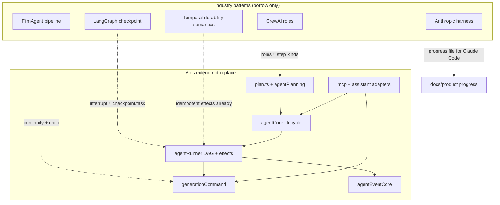
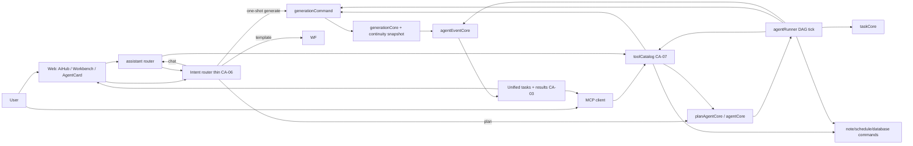
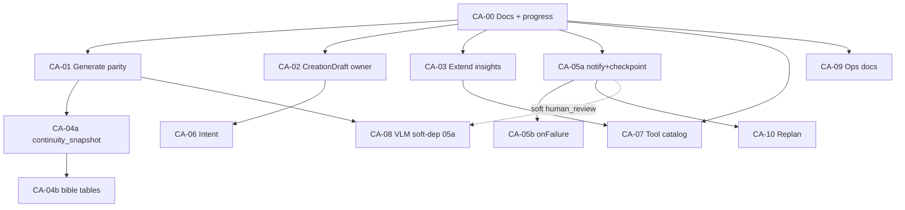

# 創作代理進化路線圖（Creative Agent Evolution Roadmap）

| 欄位 | 值 |
|------|-----|
| **Document ID** | CA-ROADMAP-2026-07 |
| **Author** | Architecture / Product (placeholder) |
| **Date** | 2026-07-30 |
| **Status** | Proposed for Claude Code execution |
| **Scope** | Aios monorepo `/workspaces/ai_os` — agent capability evolution (not full UI rewrite) |
| **Related** | `docs/AI代理架構與維運.md`, `docs/AI創作工作台-第一階段.md`, `docs/product/ai-creation-workbench-integration-pr-proposal.md`, `docs/AI代理成熟度與測試報告.md` |
| **Progress tracker** | `docs/product/creative-agent-roadmap-progress.md`（CA-00 建立） |

---

## Overview

Aios 在**團隊專案代理**維度已達產業少見深度：結構化完整計畫（`shared/plan.ts`）、安全代號規劃、DAG 人類協作、冪等副作用、`generationCommand` 單一寫入路徑、MCP 與網頁共用 core、可稽核 `agent_events`。成熟度報告評為 **88/100 RC**。

與產業「創作魔法」（多鏡定裝連貫、意圖路由、生成→評分→重規劃閉環、統一任務牆）的差距，主要不在「再裝一個 LangGraph/CrewAI」，而在**代理生成上下文未對齊直接生成**、契約中的 `notify`/`checkpoint` 尚未執行、連貫性僅 pure foundation、跨系統任務／工具未聚合。

本路線圖以 **10+ 個可獨立合併的 PR（CA-00…CA-09+）** 演進創作代理能力：借鏡 LangGraph checkpoint、CrewAI 角色門、Anthropic long-horizon harness、FilmAgent 管線與 Context Engineering 等**模式**，**不引入** LangGraph / CrewAI / Temporal 等新 runtime 依賴；延伸既有 `agentCore` / `agentRunner` / DAG / 冪等層。

本文件可直接作為 **Claude Code 多週長跑計畫**：每 session 一個 PR、進度檔 checklist、綠測後再前進。

---

## Background & Motivation

### 現況優勢（必須保留）

| 能力 | 證據 |
|------|------|
| 完整計畫契約 | `shared/plan.ts`：`sourceRefs` / `outputRefs` / `dependsOn` / 穩定 `step.id` |
| 分層邊界 | planning → core → runner → task → events；路由薄殼 |
| 安全規劃 | 短代號 `member1`/`db1`；核准前零副作用（`agentCore.planAgentCore`） |
| DAG + 人類等待 | `agentDag.ts` + runner `selectAgentDagStep`；fail-closed |
| 冪等恢復 | `agent_step_effects`、固定 `generationId`、advisory lock、事件 key 去重 |
| 生成單一 Command | `server/services/generationCommand.ts` → `submitGenerationCore`（TD-02） |
| MCP = 網頁 | `shared/mcpCatalog.ts` + `mcp.ts` 同 ACL／點數／組隔離 |
| 工作台入口（L1） | `AiHub.tsx` 四入口；WB-00 僅 `generationGates.ts` |

### 痛點（gap 分析）

1. **代理 generate 火力不足**：Runner `executeGenerationCommand` 只傳 `modelId`/`prompt`/`sceneId`/`sceneRole`，**未**傳 `characterIds`、`scenePresetIds`、`sourceAssetId`；直呼 `generationCore` 已支援。多鏡定裝在自動化路徑斷層。
2. **契約超前執行器**：`plan.ts` 含 `notify`、`checkpoint`；`AgentStep.kind` 無此二種；僅終局 `notifyRunFinished`。
3. **連貫性 foundation 未掛產線**：`shared/animationContinuity.ts` 有型別與 stale/snapshot；無 bible 版本表、無生成 lineage 寫入、無 UI 過期提示。
4. **任務／成果未跨系統聚合**：Agent insights 有 AI+人員任務；generations + workflow runs + agent runs 未後端統一讀取面。
5. **無意圖路由**：使用者手動選四入口；無 `CreationDraft` 跨模式契約落地。
6. **工具面分岔**：助手 tool 白名單、MCP catalog、Runner kinds、workflow presets 各自定義。
7. **無結果閉環**：核准後 DAG 固定；失敗 fail-closed，無 mid-run replan / VLM critic。
8. **營運證據缺口**：缺真實供應商 canary、Runner SLO 告警連線、事件冷歸檔政策。

### 為何現在做

創作價值高度依賴「代理步驟產出的圖／片與手動台同品質」。先修 **T3 代理生成對齊**（高價值、中風險、小 diff），再聚合讀取面與連貫性，最後閉環與評分，可在不重寫 runtime 的前提下連續交付可感知產品價值。

---

## Goals & Non-Goals

### Goals

1. 代理 `generate`／`voiceover` 步驟可攜帶與直接生成相同的定裝／場景／來源素材上下文，且仍只走 `executeGenerationCommand`。
2. 可執行的 `checkpoint`／`notify` 步驟語意；可選 mid-run 失敗恢復策略（修一步／等人補資訊／停止），不需整計畫重來。
3. 角色／風格 bible 版本化寫入生成 lineage；過期可偵測、可提示。
4. 專案級統一任務清單 + 成果牆讀取 API（generations ∪ workflows ∪ agents）。
5. 薄意圖路由 + `CreationDraft` 跨模式草稿契約（與工作台 WB-* 對齊但不阻塞代理 PR）。
6. 跨 assistant / MCP / runner 的統一 tool catalog 描述層（adapter 模式）。
7. 可選、成本感知的 VLM critic 品質門（預設關閉）。
8. Runner canary 文件 + SLO 探測接線指引，支撐 RC → 正式營運。
9. Claude Code 可長跑執行：進度檔、一 PR 一 session、明確 acceptance 與測試命令。

### Non-Goals

- **不**將 LangGraph、CrewAI、Temporal、OpenAI Agents SDK 作為 runtime 依賴。
- **不**分岔第二條生成扣點／核准路徑（禁止繞過 `generationCommand`）。
- **不**做無限畫布／時間軸 NLE（工作台提案明示非目標）。
- **不**在本路線圖一次完成全部 WB-01…WB-06 UI 重構（可引用為外部依賴；本路線圖以 agent 能力為主）。
- **不**自動刪除 `agent_events`（法遵未決前禁止）。
- **不**預設開啟高成本 VLM 對每鏡打分。
- **不** big-bang 重寫 `agentRunner` 或導入新 workflow engine。

---

## Industry synthesis

| 產業模式 | 來源 | Aios 已有 | 採納方式（本路線圖） |
|----------|------|-----------|---------------------|
| 顯式 DAG + 條件邊 | LangGraph StateGraph | `executionMode=dag`、`dependsOn`、`agentDag.ts` | 保持；擴充 step kinds 與失敗邊策略，不引入 StateGraph 庫 |
| Checkpoint / interrupt | LangGraph interrupt、OpenAI RunState | 人類 `wait_for_human`／`request_approval`、run 狀態機 | 落地契約已有之 `checkpoint`；審片式 pause/resume 用既有 task wake |
| 角色 Crew + 確定 Flow | CrewAI | 計畫步驟 kinds + 導演式 plan summary | 以 step kind／playbook 表達部門角色，非多 runtime agent mesh |
| Handoff specialists | OpenAI Agents SDK | 助手 → `plan_agent`；人類任務 handoff | 薄 intent router；不建 handoff 框架 |
| Long-horizon harness | Anthropic | git + docs；agent progress 概念缺產品側 | **Claude Code 執行本路線圖**用 progress JSON；產品側 shot/feature checklist 對齊 continuity |
| Durable execution | Temporal | effect receipts、固定 UUID、advisory lock、runner tick | **借語意不引依賴**；副作用仍用既有憑證矩陣 |
| FilmAgent 多角色管線 | FilmAgent / MovieAgent | split_script → create_scene → generate | 加強 Continuity 綁 ref + Critic 可選門 |
| L1→L2→L3 視頻棧 | 2026 video playbook | 分鏡 + 生成模型目錄 | 代理步驟允許 source（i2v）；preview tier 後續 |
| Character pack | IP-Adapter / multi-ref 實踐 | `characters` + `buildCharacterAnchor` | bible 版本 + lineage snapshot |
| VLM-as-Judge | VQ-Insight 等 | 無 | CA-08 可選 critic step，cost-aware |
| Context engineering | LangChain context eng. | 規劃截斷、safe refs | sourceRefs 強化；工具結果摘要 |
| Unified tool registry | MCP tools/list + ACL | `mcpCatalog`；助手另表 | `toolCatalog` 統一描述，adapter 執行 |
| Intent routing | 業界薄路由層 | 四入口手動 | CA-06 薄 router |
| PR-sized coding plans | Claude Code best practices | 本文件 PR Plan | CA-00 progress + 一 PR/session |
| 統一生成 Command | Aios TD-02 | `generationCommand` | **強制維持** |
| 事件／Insights | LangSmith 類 | `agentEventCore` | 擴充 replan／critic 事件 kinds |



---

## Key Decisions

| ID | 決策 | 理由 | 後果 |
|----|------|------|------|
| **KD-01** | 不引入 LangGraph/CrewAI/Temporal 依賴 | Aios 已有 DAG/冪等/HITL；引入會雙重 runtime 與維運成本 | 只借模式；文件禁止 `package.json` 新增這些套件 |
| **KD-02** | `generationCommand` 是唯一媒體生成寫入路徑 | TD-02；防點數／ACL 分岔 | Agent/MCP/UI/workflow 一律 `executeGenerationCommand` |
| **KD-03** | MCP 與 web 共用 cores | 成熟度與安全基線 | Tool catalog 是描述層，執行仍進既有 core |
| **KD-04** | 優先 T3 代理生成對齊，再 UX 大重構 | 高價值、中風險、不依賴 WB 全完成 | CA-01 不阻塞於 WB-01 |
| **KD-05** | `checkpoint`/`notify` 先閉環執行，失敗策略與 replan 拆 PR | 契約已有 kinds；單 PR 塞滿 L 不可獨立 rollback | **CA-05a** kinds 執行；**CA-05b** `onFailure`；**CA-10** replan |
| **KD-06** | Continuity：**CA-04a 必含** `generations.continuity_snapshot jsonb` migration；draft bible 函式寫入該欄；**嚴禁**寫入 `params` | `params` = provider falInput（核准 resume 原樣重送）；無既有 metadata 欄 | 04a = snapshot 持久化；04b = 真 bible 版本表 + stale UI |
| **KD-07** | Intent router 薄且可關閉 | 避免巨型 system prompt；低置信度 fallback chat | 規則 + 可選小模型；預設不強制 |
| **KD-08** | VLM critic 預設 off、有 reroll cap | 成本公式 take_ratio 昂貴 | Feature flag；僅 hero 鏡或人工請求 |
| **KD-09** | 一 PR 一 session、progress 檔不可刪項 | Anthropic long-horizon 實踐 | `passes: false→true` only |
| **KD-10** | **CreationDraft 單一所有權 = CA-02** 落地 `creationDraft.ts`；WB-01 **必須 import 同一模組**，不得另建平行 draft | 避免雙 sessionStorage key / 型別漂移 | 路徑與 storage key 常數見 CA-02；WB 提案 §4.2 對齊 |
| **KD-11** | CA-03 **擴充** `ProjectAgentInsights` / `agents.insights` / MCP `get_agent_insights`，不新建平行 activity feed | 既有健康／workItems／results 已是成果中心；第二聚合 = 雙真相 | 見「統一任務與成果」；`get_project_status` 維持粗摘要、細節指向 insights |
| **KD-12** | `characterIds`／`scenePresetIds`：**fail-closed**——任一 id 不屬本 `projectId` 則拒絕寫入 generation 列（不靜默 persist 外鍵） | 今日 `buildCharacterAnchor` 只過濾錨點字串仍 persist 客戶端陣列 | CA-01 在 `generationCore` 加共享校驗 |

---

## Proposed Design

### Target architecture



### 代理生成對齊（CA-01 核心）

**問題（已核對 code）**：`agentRunner` 的 generate／voiceover 區塊呼叫 `executeGenerationCommand` 時**未**傳 `characterIds`／`scenePresetIds`／`sourceAssetId`／`sourceUrl`（對照 `workflowRunner` 已傳 `characterIds`／`scenePresetIds`／`sourceUrl`——**CA-01 以 workflow 為 copy-paste 模板**）。

另有**雙閘門**使 needs 模型（i2v／圖生圖）在代理路徑不可用：

| 閘門 | 位置 | 今日行為 |
|------|------|----------|
| A | `agentPlanning.safeModel` | `if (requested && !requested.needs) return requested; else DEFAULT_IMAGE_MODEL` — **靜默降級**任何 needs 模型 |
| B | `agentRunner` generate | `if (!model \|\| model.needs) return failRun(..., "計畫裡的模型無效或需要來源素材")` — **即使有 source 也 fail** |

只改 runner 透傳、不改 A+B，i2v 仍不可用。

**設計（CA-01 必須原子完成）**：

1. **契約欄位** — `shared/plan.ts` `planStepSchema` 與 runner `AgentStep` 增加可選：
   - `characterIds?: string[]`（max 6，對齊 `server/routers/generation.ts`）
   - `scenePresetIds?: string[]`（max 4）
   - `sourceAssetId?: uuid`
   - `sourceUrl?: string`（僅當無 asset；仍走 generationCore SSRF／needs 守門）
2. **PlannerAliases 擴充**（今日僅 `members|notes|schedules|tasks|databases`）：
   - 新增 `characters`、`scenePresets`、`assets`（`PlannerAlias[]`）
   - 代號：`char1…`、`preset1…`、`asset1…`（1-based，與 member 慣例一致）
   - `referenceFor` / `aliasMap` 支援三類；`buildPlannerContext`（`agentCore.ts`）查本 project 角色／場景 preset／素材（limit 例如 char 20、preset 20、asset 30），寫入 prompt 區塊 `<角色定裝代號>` 等
3. **Draft schema** — `agentPlanning` generate 分支：
   ```ts
   // completePlanDraftSchema generate arm（示意）
   {
     kind: "generate",
     prompt: string,
     sceneNo?: number,
     modelId?: string,
     characterRefs?: string[],      // ["char1"]
     scenePresetRefs?: string[],  // ["preset1"]
     sourceAssetRef?: string,     // "asset3"
     sourceUrl?: string,          // 僅無 asset 時；規劃端可拒非 https
   }
   ```
4. **`safeModel` 重寫**（與 runner 閘門一併改）：
   - 無 `needs` → 保留 requested（今日行為）
   - 有 `needs` **且** draft 已解析出 `sourceAssetId` 或非空 `sourceUrl` → **保留** requested needs 模型；估點用 `model.points`（與現況 generate 一致；TTS 類仍走既有）
   - 有 `needs` **但缺 source** → **不**靜默降級：該步 `continue` 並 `missingInformation.push("步驟「…」模型需要來源素材，請指定 sourceAssetRef 或改用無 needs 模型")`
   - 完全無效 modelId → missingInformation（不塞 DEFAULT 若明確指定了壞 id；未指定 modelId 仍可 DEFAULT_IMAGE_MODEL）
5. **Runner 閘門 B**：改為 `if (!model) failRun`；`if (model.needs && !step.sourceAssetId && !step.sourceUrl?.trim()) failRun("…需要來源素材")`；有 source 則放行。
6. **透傳**：對齊 `workflowRunner`：
   ```ts
   await executeGenerationCommand({
     auth, source: "agent", backgroundResume: true,
     id: step.generationId, projectId: run.projectId,
     modelId, prompt, sceneId, sceneRole,
     characterIds: step.characterIds,
     scenePresetIds: step.scenePresetIds,
     sourceAssetId: step.sourceAssetId,
     sourceUrl: step.sourceUrl,
     agentRunId: run.id, reasonPrefix: "AI 代理",
   });
   ```
   `generationCommand`／`SubmitCoreInput` **已支援**上述欄位，無需改 Command 形狀。
7. **專案歸屬 fail-closed（KD-12）** — 新增共享 helper（建議 `assertGenerationEntityIds(projectId, { characterIds, scenePresetIds, sourceAssetId })`）：
   - 規劃 resolve：未知 `charN` → missingInformation；**不得**把未解析字串當 UUID 寫入 step
   - `submitGenerationCore`：若傳入任一 id，必須全部屬於本 `projectId`（characters／scene_presets／assets 表 + 未刪除）；否則 `BAD_REQUEST`／TRPC 錯誤，**不**寫 generation 列、**不**把外鍵 UUID 塞進 `character_ids` jsonb
   - 今日 `buildCharacterAnchor` 只過濾錨點文字仍 persist 客戶端陣列——CA-01 **必須修此落差**
8. **規劃 prompt**（`agentCore` 內 hardcoded generate 欄位表）：改為列出 `prompt、sceneNo?、modelId?、characterRefs?、scenePresetRefs?、sourceAssetRef?`；可用 kinds 文案同步。
9. **sourceRefs**：resolve 後寫入 character／preset／asset 的 `PlanReference`。
10. **Kind 聯集鎖**（Issue 8）：`shared/planTypes` 或新測試斷言 draft generate 可攜欄位與 runner `AgentStep` 一致；完整 kinds 子集測試見 CA-00／CA-05a。

### Checkpoint / Notify / 失敗恢復（CA-05a / CA-05b / CA-10）

#### 欄位契約（CA-05a 必實作）

| Kind | 必要／可選欄位 | `actorType` 預設 | 執行語意 | 冪等 |
|------|----------------|------------------|----------|------|
| `notify` | **必**：`message`（新欄，max 500，人話摘要，**禁止**塞 full prompt）<br>**可**：`notifyChannels?: ("in_app"\|"push")[]` 預設 `["in_app","push"]`；`title?` | `system` | 對 run 發起人（+ 可選 mentions 後續）寫站內訊息（對齊 `notifyRunFinished` 路徑）與／或 push；寫 event | `eventKey = step:{stepId}:notify`；`(runId,eventKey)` 唯一 → 重播 no-op；**不**需 `effectId` 除非未來寫 DB 列 |
| `checkpoint` | **可**：`requiresApproval?: boolean`（預設 false）<br>`approverRole?`（同 request_approval）<br>`milestoneId?`<br>`note`／`title` 作審核說明<br>**可**：`message?`（給人看的檢查說明） | `requiresApproval` → `human`，否則 `system` | **無核准**：寫 event `checkpoint`，step → `done`，DAG 繼續<br>**有核准**：比照 `request_approval`／`wait_for_human`：`persistStepEffectId` 建 `project_tasks`（taskType approval），step → `waiting`，run 可能 `waiting`；**無關分支**（不依賴此 step）仍可被 DAG 選中執行 | task 用 `effectId` 當 task UUID；event `step:{stepId}:checkpoint`／`waiting` |
| （共用） | `dependsOn`、`sourceRefs`、`outputRefs` 既有 | — | checkpoint 完成後下游 dependsOn 才可跑 | — |

**plan.ts 變更**：為 `notify`／`checkpoint` 補 `message?: string`（或 notify 必填）；draft schema 同步加入兩 kind（今日 draft discriminatedUnion **沒有**它們）。

**未知 kind（混合版本部署）**：runner 在所有已知 `if (step.kind === …)` 之後 **必須** `failRun(…, "不支援的步驟種類：…")`，**禁止** skip／silent done。新 planner + 舊 runner → 清晰失敗；舊 plan 無新 kind 不受影響。

#### 失敗策略（CA-05b，與 05a 拆 PR）

| 欄位 | 位置 | 值 | 預設 |
|------|------|-----|------|
| `onFailure` | **step 可選**；未設則讀 plan summary 可選 `defaultOnFailure`；再預設 | `fail_closed` \| `pause_for_input` \| `retry_once` | `fail_closed`（今日語意） |

- `fail_closed`：現況 markRestStopped + run failed  
- `pause_for_input`：step waiting + human task「補資訊／改參數」+ event；**不**自動重送已扣點 generate  
- `retry_once`：僅限無副作用或明確可重試步（generate → **新** `generationId`）；第二次仍失敗 → fail_closed  

CA-05b 須含架構檢查表：unit + **真 PostgreSQL** task wake／effect 競態測試（`agentEffectCore.pg.test.ts`／`taskWake.pg.test.ts` 模式）。

#### Mid-run replan（CA-10 only）

- API：`agents.replanFromStep`；權限 open question #2  
- 保留 done `outputRefs`；未開始 steps 停；**禁止**重送已成功 generationId  

### Character / Style bible（CA-04）

**已關閉儲存決策（Issue 1／9）**：

| 項目 | 決定 |
|------|------|
| `generations.params` | **禁止**寫入 continuity；該欄 = provider `falInput`，成本核准 resume 原樣重送（`generationCore` 註解） |
| `detail` | **不是** generations 欄；屬 agent step 執行態 |
| `character_ids`／`scene_preset_ids` | 已有；存的是卡 id，**不是** `GenerationContinuitySnapshot` |
| **CA-04a 必做** | migration：`continuity_snapshot jsonb` nullable on `generations`（Drizzle `server/db/schema/generation.ts` + `drizzle/00xx_….sql`） |
| 寫入時機 | `submitGenerationCore` 插入／更新列時：`characterToDraftBibleVersion` / `buildShotCharacterRefsFromCharacters` + `buildGenerationContinuitySnapshot` → 寫入 `continuity_snapshot` |
| **CA-04b** | 真 `character_bible_versions`／`style_bible_versions` 表、升版、UI `formatStaleContinuityHint` |

代理路徑在 CA-01 透傳 `characterIds` 後自動進入同一 snapshot 路徑。

### 統一任務與成果（CA-03）— **擴充 insights，不平行新建**

**決策（KD-11）**：在 `getProjectAgentInsights`（`agentEventCore.ts`）／tRPC `agents.insights`／MCP `get_agent_insights` **擴充** shape，不另起 `projectActivityCore` 作為第二真相。

#### WorkItem 契約（避免 AgentCard「人員」誤標）

**推薦（預設採納）**：`kind` **只表示執行者類別**，保持既有二元；**系統來源**一律用 `source`。

```ts
// server/services/agentEventCore.ts — ProjectAgentWorkItem
// kind：執行者類別 ONLY（勿塞 generation/workflow，否則 AgentCard 舊邏輯會標成「人員」）
kind: "ai" | "human";
// source：產出來源／系統（chips 與文案用此欄）
source: "agent_run" | "human_task" | "generation" | "workflow_run";
hrefHint?: string;
points?: number;

// 建議對應：
// generation queued/running  → kind:"ai",  source:"generation"
// workflow run active        → kind:"ai",  source:"workflow_run"
// agent run step             → kind:"ai",  source:"agent_run"
// human task / approval      → kind:"human", source:"human_task"
```

**前端標籤（CA-03 同 PR 必改）**：

```ts
// client/src/components/AgentCard.tsx — 今日（回歸點）
// item.kind === "ai" ? "AI" : "人員"  // generation/workflow 若誤擴 kind 會變「人員」

// CA-03 後：以 source 為主、kind 為備援
function workItemChipLabel(item: { kind: "ai" | "human"; source?: string }): string {
  switch (item.source) {
    case "generation": return "生成";
    case "workflow_run": return "範本";
    case "agent_run": return "AI 計畫";
    case "human_task": return "人員";
    default: return item.kind === "ai" ? "AI" : "人員";
  }
}
```

若日後堅持擴 `kind` enum，**必須**同時落地完整 display map，且 acceptance 禁止 generation 顯示「人員」——但本路線圖**不採**該路徑，以免與既有 `kind === "ai" ? "AI" : "人員"` 二元語意衝突。

**results**：既有 `outputRefs` 去重 + 近期 done generations（`type: "generation"`）合併同一 `results[]`。

| 表面 | CA-03 後角色 |
|------|----------------|
| `agents.insights` / `get_agent_insights` | **權威**統一任務 + 成果 + 健康 |
| MCP `get_project_status` | 維持粗粒度摘要；**不**複製完整 workItems |
| `AgentCard.tsx` 任務 chips | **同 PR 必改** label／source map（見上） |
| AiHub 活動 pill（若有） | 同 PR 對齊同一 label map；禁止第三套輪詢 |

實作可抽 private helpers 於 `agentEventCore.ts`；**前端不可標 optional**——凡消費 `workItems` 的元件都在 CA-03 touch list。

### Intent router + CreationDraft（CA-02／CA-06）

**CA-02 擁有契約模組**（KD-10）：

```ts
// client/src/features/creation-workbench/creationDraft.ts  — 唯一實作
export const CREATION_DRAFT_STORAGE_PREFIX = "aios:creationDraft:v1:";
// key = CREATION_DRAFT_STORAGE_PREFIX + projectId

export interface CreationDraft {
  goal: string;
  mode: "ask" | "generate" | "template" | "plan";
  category?: string;
  modelId?: string;
  prompt?: string;
  sourceAssetIds: string[];
  characterIds: string[];
  scenePresetIds: string[];
  worldviewEnabled: boolean;
  templateId?: string;
}
```

- WB 提案 §4.2 同形；**WB-01 必須** `import { … } from "./creationDraft"`（或 package path），不得再定義第二份 interface／storage key。  
- CA-06 依賴 CA-02（非 WB-01）；intent 只讀寫同一 draft。  
- Merge window：若 WB-01 與 CA-02 同開，以 CA-02 合入為先或同 PR 串联；progress 註記 owner。

```ts
type IntentResult = {
  intent: "chat" | "one_shot_generate" | "multi_step_plan" | "template";
  confidence: number;
  playbookId?: string;
  suggestedDraft?: Partial<CreationDraft>;
};
```

路由：規則優先；低置信度 → `chat`；可選 LLM 僅 flag。

### 統一 Tool Catalog（CA-07）

```ts
// shared/toolCatalog.ts（新）
type ToolTransport = "assistant" | "mcp" | "runner" | "workflow";
type ToolDescriptor = {
  id: string;
  title: string;
  description: string;
  transport: ToolTransport[];
  access: "read" | "write";
  riskLevel: "low" | "mid" | "high";
  inputSchemaVersion: number;
};
```

- `mcpCatalog` 衍生或雙向測試；助手 tool 枚舉 ⊆ catalog。

### VLM Critic（CA-08，可選滯後）

- Flag off 預設；reroll cap 2；超限 → **既有** `create_task`／`wait_for_human` 模式建 human task（**不硬依賴** checkpoint kind；CA-05a 為軟依賴）。
- 不繞過 `generationCommand`。

### 與工作台 UX（T1）的關係

| 項目 | 本路線圖 | WB 提案 |
|------|----------|---------|
| 前綴 | **CA-*** = agent 能力 | **WB-*** = 工作台 UX（無 ID 碰撞） |
| CreationDraft | **CA-02 擁有** 模組 | WB-01 import 同一模組 |
| AiHub 四入口 | 保留；CA-06 intent 建議 | WB-01 shell |
| 直接生成抽出 | 非 CA 必做 | WB-02 |

---

## API / Interface Changes

### Plan / Runner（CA-01, CA-05a）

| 位置 | 變更 |
|------|------|
| `shared/plan.ts` | generate：`characterIds`／`scenePresetIds`／`sourceAssetId`／`sourceUrl`；notify/checkpoint：`message` 等 |
| `server/services/agentPlanning.ts` | `PlannerAliases` + `safeModel` + generate draft refs + notify/checkpoint draft arms（05a） |
| `server/services/agentCore.ts` | `buildPlannerContext` 載入 char/preset/asset；規劃 prompt 欄位表 |
| `server/services/agentRunner.ts` | `AgentStep` 欄位；needs 閘門；透傳（模板：`workflowRunner` `executeGenerationCommand`）；notify/checkpoint 分支；**unknown kind → failRun** |
| `server/services/generationCore.ts` | `assertGenerationEntityIds` fail-closed（CA-01） |
| `server/services/generationCommand.ts` | **不改**形狀（已透傳 `SubmitCoreInput`） |
| `client` AgentCard | 新 kinds 文案／icon（05a） |

### Insights 擴充（CA-03）

| 位置 | 變更 |
|------|------|
| `server/services/agentEventCore.ts` | 擴 `ProjectAgentWorkItem`：**`kind` 維持 `ai\|human`**；新增 `source`；查詢 generations／workflows |
| `server/routers/agents.ts` | `insights` procedure 輸出隨之 |
| `server/services/mcp.ts` + `shared/mcpCatalog.ts` | `get_agent_insights` 回應；`get_project_status` 不複製完整 feed |
| **`client/src/components/AgentCard.tsx`（必改）** | workItems chip 改 `source` label map；禁止 generation→「人員」 |
| `client/src/components/AiHub.tsx`（若顯示 workItems／活動摘要） | 同 label map |
| client 測試 | `AgentCard` 相關或 insights 標籤單元測 |

### Continuity（CA-04a／04b）

| 位置 | 變更 |
|------|------|
| `server/db/schema/generation.ts` | **必**：`continuitySnapshot: jsonb("continuity_snapshot")` |
| `drizzle/00xx_continuity_snapshot.sql` | expand nullable jsonb |
| `generationCore.ts` | 寫入 snapshot；**永不**寫入 `params` |
| `shared/animationContinuity.ts` | 既有 pure 函式 |
| CA-04b | bible 版本表 + `CharacterCards` stale UI |

### Intent / Draft（CA-02, CA-06）

| 位置 | 變更 |
|------|------|
| `client/src/features/creation-workbench/creationDraft.ts` | **CA-02 擁有**；WB-01 import |
| `intentRouter.ts` / assistant | CA-06 |

### Tool catalog / Critic

同前：`shared/toolCatalog.ts`；`qualityGate.ts` + flag。

---

## Data Model Changes

| PR | Schema | 策略 |
|----|--------|------|
| CA-00–03, 05a/b, 06–07, 09 | 無表變更或僅 steps JSON 形狀 | expand 相容；舊 run 缺欄 = undefined |
| **CA-04a** | **`generations.continuity_snapshot jsonb` NULL** | **必 migration**；禁止用 `params`；回滾 = 停寫欄、欄可留 |
| CA-04b | bible 版本表 | expand → 雙寫 → 回填 |
| CA-10 replan | 可選 `replan_parent_id`；可先只靠 events | — |
| CA-08 | 可選 step/generation scores JSON | 無硬刪 |

Migration 紀律：`docs/資料庫遷移.md`；Web replica 不跑 DDL；CA-04a 驗收含 `scripts/ci-migration-test.sh`。

---

## Alternatives Considered

### Alt-1：引入 LangGraph 作為 agentRunner 替換

- **優點**：生態 checkpoint、社群範例多。
- **缺點**：與既有 effect/DAG/task wake 重複；TypeScript/Python 混部；雙套可觀測；違反 KD-01。
- **結論**：否決。只借 interrupt 語意。

### Alt-2：CrewAI 多角色子進程

- **優點**：導演／編劇角色心智模型清晰。
- **缺點**：Aios 已是「單 runner + 多 step kinds」；多 agent mesh 增加幻覺與成本；權限難對齊 project ACL。
- **結論**：否決 runtime；用 step kinds + planning playbook 表達角色。

### Alt-3：Temporal 承接所有 agent runs

- **優點**：跨天 durable 最強。
- **缺點**：基礎設施與營運成本大；現有 tick + 憑證已覆蓋崩潰恢復；導入週期遠超本路線圖。
- **結論**：暫緩；語義對齊即可。若未來 runner 多區域部署再評估。

### Alt-4：先做完整 WB UI 再動代理後端

- **優點**：使用者感知入口統一。
- **缺點**：代理產出品質差距仍在；UI 重構風險高、週期長；gap 分析建議 T3 與 T1 可並行且 T3 後端獨立。
- **結論**：CA-01 優先；WB 外部並行（KD-04/10）。

### Alt-5：代理生成另開「簡化 core」不走 Command

- **優點**：看似少參數。
- **缺點**：破壞 TD-02；點數／核准分岔。
- **結論**：嚴禁。

---

## Security & Privacy Considerations

| 威脅 | 緩解 |
|------|------|
| 規劃幻覺 UUID 寫入 | 短代號解析；未知 → `missingInformation`；不落地 step |
| 代理帶 sourceUrl SSRF | generationCore 既有 URL 守門；代理不新增例外 |
| **外鍵 characterIds 污染 lineage** | **今日漏洞**：anchor 過濾仍 persist 客戶端陣列。CA-01：`assertGenerationEntityIds` **fail-closed**，外鍵 UUID **不得**寫入 `character_ids`／`scene_preset_ids` |
| notify 洩漏 prompt | `message` max 500；事件／推播禁 full prompt／token |
| replan 重扣點 | 禁重送已成功 generationId；新嘗試新 id |
| MCP 工具面擴大 | catalog access；唯讀 token 擋 write |
| VLM 外送成片 | 僅授權 provider；日誌不存原圖 base64 |
| Intent 誤路由高成本 | 低置信度 → chat；plan 仍要核准 |

威脅模型：**核准前零副作用**；每步重驗 ACL、封存、額度。

---

## Observability

| 層 | 做法 |
|----|------|
| Events | 既有 append-only `agent_events`；新增 kinds：`checkpoint`、`step_notify`、`replan`、`quality_gate`、`generate_context`（含 sourceRefs 摘要） |
| Metrics | Runner tick lag、step fail rate by kind、generate with/without characterIds 比例、quality reroll count、intent distribution |
| Logs | 既有 request id；禁止 prompt 全文進 info log |
| Health | `/api/ready` + `runnerReadiness`；CA-09 接告警 |
| Insights | 擴 blocked 原因：waiting_checkpoint、quality_human_review |
| Eval（工程） | 金標計畫 JSON：含 character 代號解析；trajectory 不強制路徑匹配（outcome 優先） |

對齊產業：Run → Trace（agent run）→ Thread（project）；失敗分類 tool / permission / model / data。

---

## Rollout Plan

1. **CA-00** 合入 main：文件 + progress tracker + glossary。
2. 後續 PR 自然相容（缺欄位 = 舊行為）或 flag。
3. CA-01：staging 含角色＋needs 模型案例；entity id fail-closed 測試。
4. **CA-04a**：`continuity_snapshot` expand migration；回滾 = 應用停寫該欄。
5. **混合版本 runner**：未知 step kind → failRun（永不 skip）；滾動升級先 runner 後放行含新 kind 的 plan，或短維護窗。
6. CA-08：flag 預設 off。
7. CA-09：canary／SLO 文件；證據齊前維持 RC。
8. **Rollback**：相容 schema 映像；不刪 events；進行中 run 可 stop。

Staged：internal group → all；replan／critic 僅 flag。

---

## Claude Code long-run harness

對齊 Anthropic long-horizon harness，**用於執行本路線圖的實作者（Claude Code / 人類）**：

### 進度檔約定

路徑：**`docs/product/creative-agent-roadmap-progress.md`**

（可附 JSON 副本。）

**Glossary（CA-00 必須寫入 progress 檔首）**：

```text
CA-* = 創作代理能力路線圖 PR
WB-* = AI 創作工作台 UX PR（docs/product/ai-creation-workbench-integration-pr-proposal.md）
CreationDraft 模組所有權 = CA-02（WB-01 必須 import，禁止分叉）
```

規則：

1. **禁止刪除** checklist 項；只允許 `passes: false` → `true`（合併後）。
2. 每 PR 區塊：`id`, `title`, `passes`, `branch`, `merged_sha`, `notes`, `est_sessions`。
3. Session 結束：綠測 + 可開 PR／可合併狀態 + 更新 progress。
4. **平行政策**：每位實作者（agent）**同時最多一條實作分支**；**純文件 PR（CA-00／CA-09）可與一條功能 PR 並行**。依賴圖允許 CA-01∥CA-02∥CA-03 時，由**不同**工作樹／人或等前一條合入／明確託管 notes——**同一 Claude session 不開第二條實作**。
5. 開 PR 未合入：`passes` 仍 false；`notes` 記 PR URL；下一個 session **不得**假設已合入而開依賴它的 PR，除非 dependency 已在 main。
6. 失敗兩次同錯 → 停、寫 notes、縮 scope。
7. 實作 **CA-05a／CA-05b／CA-08** 前必重讀 `docs/AI代理架構與維運.md`「新增步驟種類檢查表」。

### 粗估工作量（session ≈ 半日～1 日專注）

| PR | est_sessions | 備註 |
|----|-------------:|------|
| CA-00 | 0.5 | 文件 |
| CA-01 | 2 | 雙閘門 + aliases + entity ACL |
| CA-02 | 1 | draft 模組 |
| CA-03 | 1–2 | 擴 insights |
| CA-04a | 1–2 | 含 migration |
| CA-04b | 2+ | 版本表可另排 |
| CA-05a | 2 | notify+checkpoint + pg 測 |
| CA-05b | 1–2 | onFailure |
| CA-06 | 1 | intent |
| CA-07 | 1 | catalog |
| CA-08 | 2 | flag off 可滯後 |
| CA-09 | 0.5–1 | ops 文件 |
| CA-10 | 2 | replan |

### Session 工作流

```text
1. git checkout main && git pull
2. 讀 docs/product/creative-agent-roadmap-progress.md
3. 選第一個 passes:false 且 dependencies 的 merged_sha 已在 main 的 CA-xx
4. git checkout -b <suggested-branch>
5. 按 Implementation steps（CA-05/08 對照架構檢查表）
6. Suggested test commands 全綠
7. 更新 progress notes；passes 僅在合併後改 true（或團隊約定：acceptance 過且 PR 開出可先 partial）
8. commit；開 PR；本 session 結束
```

### 建議 progress JSON 形狀

```json
{
  "roadmapId": "CA-ROADMAP-2026-07",
  "updatedAt": "2026-07-30T00:00:00Z",
  "glossary": { "CA": "agent capability", "WB": "workbench UX" },
  "prs": [
    {
      "id": "CA-00",
      "title": "Docs landing + progress tracker",
      "passes": false,
      "est_sessions": 0.5,
      "branch": null,
      "mergedSha": null,
      "notes": ""
    }
  ]
}
```

### 與產品 agent 的關係

產品內 agent **不**改此 progress 檔；此 harness 僅工程執行路線圖。

---

## Open Questions

1. ~~Continuity snapshot 寫入欄位~~ → **已決（KD-06）**：`generations.continuity_snapshot jsonb`；禁 `params`。
2. Replan 是否允許非發起人（組長）觸發？（CA-10）
3. ~~統一 activity 命名空間~~ → **已決（KD-11）**：擴 `agents.insights`／`get_agent_insights`，不平行 feed。
4. Intent 分類是否允許小模型扣點？預設規則免費。
5. VLM provider 選型與點數匯率（CA-08）。
6. ~~notify channel~~ → **預設** `in_app`+`push`；`notifyChannels` 可覆寫（CA-05a 契約）。仍可產品微調預設。
7. ~~WB-01 與 CA-02 所有權~~ → **已決（KD-10）**：CA-02 擁有模組；WB-01 import。時程仍可協調，但所有權不開放。
8. `agent_events` 保留年限（法遵）——不阻塞功能 PR。

---

## 研究來源摘要

本文件綜合四份內部研究簡報與既有產品／架構文件：

| 簡報 | 路徑 | 對本路線圖的關鍵輸入 |
|------|------|----------------------|
| 編排與 runtime | `docs/research/creative-agent-2026-07/01-orchestration.md` | LangGraph checkpoint/HITL、CrewAI roles+flows、OpenAI handoff、Anthropic harness、Temporal durable；**借模式不引依賴** |
| 創意媒體 | `docs/research/creative-agent-2026-07/02-creative-media.md` | FilmAgent 角色、character pack、L1/L2/L3、VLM critic、成本 take_ratio、Shot Spec |
| 記憶／工具／評測 | `docs/research/creative-agent-2026-07/03-memory-eval-tools.md` | Context engineering、統一 tool registry、三層 eval、intent routing、PR-sized plans |
| Aios 差距 | `docs/research/creative-agent-2026-07/04-aios-gap.md` | Already strong / partial / missing；T1–T8 主題與檔案 touchpoints；優先序 T3 等 |

### 關鍵外部 URL（來自研究簡報）

- LangGraph HITL：https://www.langchain.com/blog/making-it-easier-to-build-human-in-the-loop-agents-with-interrupt
- LangGraph persistence：https://langchain-ai.github.io/langgraph/concepts/persistence/
- Anthropic long-running harness：https://www.anthropic.com/engineering/effective-harnesses-for-long-running-agents
- Anthropic multi-agent research：https://www.anthropic.com/engineering/multi-agent-research-system
- OpenAI Agents HITL：https://openai.github.io/openai-agents-python/human_in-the_loop/
- Temporal agentic AI：https://temporal.io/blog/build-resilient-agentic-ai-with-temporal
- FilmAgent：https://filmagent.github.io/ · https://arxiv.org/html/2501.12909v1
- 2026 AI Video Playbook：https://medium.com/data-science-collective/the-2026-ai-video-production-playbook-bc683d5b85da
- Context engineering：https://www.langchain.com/blog/context-engineering-for-agents/
- MCP tools：https://modelcontextprotocol.io/docs/concepts/tools
- Agent evals：https://www.anthropic.com/engineering/demystifying-evals-for-ai-agents
- Claude Code best practices：https://code.claude.com/docs/en/best-practices
- VLM-as-a-Judge：https://www.emergentmind.com/topics/vlm-as-a-judge

### 站內文件

- `docs/AI代理架構與維運.md`
- `docs/AI創作工作台-第一階段.md`
- `docs/product/ai-creation-workbench-integration-pr-proposal.md`
- `docs/AI代理成熟度與測試報告.md`
- `docs/architecture/anim-02-continuity.md`
- `docs/SLO與事故應變.md`
- `docs/architecture/technical-debt-remediation-plan.md`（TD-02 Command）

---

## Risks

| 風險 | 嚴重度 | 緩解 |
|------|--------|------|
| 代理 needs 模型燒點暴增 | High | 缺 source → missingInformation；估點進 summary；核准門檻 |
| plan／draft／runner kinds 漂移 | High | **強制測試**：`planStepKindSchema` options 與 draft kinds、runner 可執行 kinds 關係斷言（allowlist 記錄契約超前項至 05a 關閉） |
| 外鍵 ID 寫入 generation | High | `assertGenerationEntityIds` + 測試 |
| Replan 雙重扣點 | High | 新 generationId only |
| Continuity migration | Med | 單欄 jsonb expand；低峰 |
| 新 kind + 舊 runner | Med | unknown → failRun；滾動升級順序 |
| Tool catalog 雙源 | Med | MCP names ⊆ catalog 測試 |
| CA-02／WB-01 分叉 draft | Med | KD-10 單一 owner + storage key 常數 |
| 長跑半完成 | Med | 一實作分支／agent；CI |
| VLM 分數通脹 | Low | 預設 off |

---

## References

- Issue #133 PR A–E 代理基礎（見架構文）
- TD-02 `generationCommand.ts`
- ANIM-02 `shared/animationContinuity.ts`
- WB-00 `client/src/features/creation-workbench/generationGates.ts`
- E2E：`scripts/e2e-agent.py`、`scripts/e2e-ui/verify-agent.mjs`、`scripts/e2e-ui/verify-workbench.mjs`

---

## Claude Code 執行指南（快速卡）

| 步驟 | 動作 |
|------|------|
| 選 PR | progress：`passes:false` 且依賴已 **merged to main** |
| 平行 | 同一 agent **一條**實作分支；文件 PR 可並行 |
| 分支 | 自 `main` 開 suggested branch |
| 實作 | 僅該 PR steps；CA-05/08 對照架構「新增步驟種類檢查表」 |
| 測試 | Suggested commands 全綠 |
| 開 PR | Title 含 `CA-xx` |
| 結束 | 更新 progress notes；勿開下一實作 PR |

全域回歸：

```bash
npm run audit:high && npm run typecheck && npm test && npm run test:client:coverage && npm run build
scripts/ci-migration-test.sh   # 有 migration 時必跑
scripts/e2e-agent.py
```

---

## PR Plan

> 順序：CA-00 → CA-01（最高價值）→ CA-03∥CA-02 → CA-04a → CA-05a → CA-05b → CA-06 → CA-07 → CA-08（滯後）→ CA-09∥隨時 → CA-10。  
> 每個 PR 可獨立 review／rollback；**CA-05 已硬拆 a/b**。

---

### CA-00 — 文件落地與進度追蹤器

| 欄位 | 內容 |
|------|------|
| **PR id** | CA-00 |
| **Title** | docs: Creative Agent Evolution Roadmap + progress tracker |
| **Branch** | `docs/ca-00-creative-agent-roadmap` |
| **Dependencies** | 無 |
| **Size** | S · est 0.5 session |
| **Files** | `docs/product/creative-agent-evolution-roadmap.md`；`docs/product/creative-agent-roadmap-progress.md`（+ 可選 JSON）；架構文交叉連結 |

**Implementation steps**

1. [ ] 入庫本設計審定版。
2. [ ] progress：CA-00…CA-10（含 05a/05b）、`passes:false`、依賴、est_sessions。
3. [ ] **Glossary**：`CA-*` vs `WB-*`；CreationDraft owner = CA-02。
4. [ ] 可選：`shared/planTypes.test.ts` 或文件中列出「kinds 聯集測試將於 CA-01 骨架／CA-05a 關閉契約超前」——若本 PR 加測試骨架：`planStepKindSchema` 含 notify/checkpoint 而 runner 尚未執行 = 允許的 **documented allowlist**，CA-05a 移除 allowlist。
5. [ ] 無 runtime／`package.json` 依賴變更。

**Acceptance criteria**

- [ ] progress + glossary 存在。
- [ ] 聲明：禁 LangGraph/CrewAI/Temporal；`generationCommand` 單一寫入；continuity 禁寫 `params`。

**Out of scope**：任何行為變更。

**Suggested test commands**：`npm run typecheck`

---

### CA-01 — 代理生成與直接生成火力對齊

| 欄位 | 內容 |
|------|------|
| **PR id** | CA-01 |
| **Title** | feat(agent): generate parity — characters, presets, source, needs models |
| **Branch** | `feat/ca-01-agent-generate-parity` |
| **Dependencies** | CA-00 |
| **Size** | M · est 2 sessions |
| **Files** | `shared/plan.ts`；`server/services/agentPlanning.ts` + tests；`agentCore.ts`（`buildPlannerContext`、prompt 表）；`agentRunner.ts` + tests；`generationCore.ts`（`assertGenerationEntityIds`）；`agentPlanning` aliases；**模板**：`workflowRunner.ts` `executeGenerationCommand` 呼叫；`shared/planTypes.test.ts` 或 `agentStepKinds.test.ts`（generate 欄位／kinds 關係）；**不改** `generationCommand.ts` 形狀 |

**Implementation steps**

1. [ ] `planStepSchema` + `AgentStep`：`characterIds`／`scenePresetIds`／`sourceAssetId`／`sourceUrl`。
2. [ ] `PlannerAliases` + `characters`／`scenePresets`／`assets`；`referenceFor`；`buildPlannerContext` 查庫 + prompt 區塊；截斷 limit。
3. [ ] Draft generate：`characterRefs`／`scenePresetRefs`／`sourceAssetRef`；未知 → missingInformation。
4. [ ] **同時**改 `safeModel` 與 runner `model.needs` 閘門（見 Proposed Design）；缺 source 不靜默降級。
5. [ ] Runner 透傳：對齊 workflowRunner 欄位列表。
6. [ ] `assertGenerationEntityIds` 於 `submitGenerationCore`：外鍵 id → 錯誤且**不** persist。
7. [ ] sourceRefs 寫入；規劃 prompt 欄位表更新。
8. [ ] 測試：resolve `characterRefs:["char1"]`→ UUID；needs+source 保留 model；needs 無 source → missing；foreign UUID 不落 generation 列；舊 step 無新欄可跑。
9. [ ] Kind／欄位鎖測試（與 CA-00 allowlist 銜接）。

**Acceptance criteria**

- [ ] 端到端（mock）：draft 含 `sourceAssetRef` + needs `modelId` → resolve 保留模型 → runner 傳 source → `executeGenerationCommand` 被呼叫且含 characterIds/source。
- [ ] `characterRefs:["char1"]` 解析為專案角色 UUID。
- [ ] 外鍵 character UUID **不**出現在 generation.character_ids。
- [ ] grep：agent 路徑無直接 `submitGenerationCore`。
- [ ] 舊計畫無新欄仍可 run。

**Out of scope**：bible 表、VLM、replan、WB 重構、notify/checkpoint 執行。

**Suggested test commands**

```bash
npm test -- agentPlanning agentRunner agentCore generationCore planTypes
npm run typecheck
scripts/e2e-agent.py
```

---

### CA-02 — CreationDraft 契約模組（WB-01 必須 import）

| 欄位 | 內容 |
|------|------|
| **PR id** | CA-02 |
| **Title** | feat(workbench): CreationDraft module (single owner for WB-01) |
| **Branch** | `feat/ca-02-creation-draft-contract` |
| **Dependencies** | CA-00；WB-00 已存在 `generationGates.ts` |
| **Size** | M · est 1 session |
| **Files** | `client/src/features/creation-workbench/creationDraft.ts`；`__tests__/creationDraft.test.ts`；可選輕觸 `AiHub.tsx`；在 workbench 提案或 progress 註明 **WB-01 import path + `CREATION_DRAFT_STORAGE_PREFIX`** |

**Implementation steps**

1. [ ] `CreationDraft` + `CREATION_DRAFT_STORAGE_PREFIX` + load/save/clear。
2. [ ] `applyToGeneratePayload` 對齊 `buildGenerationSubmitInput`。
3. [ ] `applyToPlanGoal` helper。
4. [ ] 測試 round-trip；mode 切換不丟欄位。
5. [ ] **不**大拆 ProjectPage；文件一句：WB-01 禁止第二份 draft。
6. [ ] 若 WB-01 已合：改為改接 import（本 PR 變銜接）。

**Acceptance criteria**

- [ ] 模組路徑穩定；storage key 有常數。
- [ ] 欄位 ⊇ CA-01 上下文。
- [ ] 無第二生成 mutation。

**Out of scope**：WB-02…06；intent API（CA-06）。

**Suggested test commands**：`npm run test:client -- creationDraft generationGates`；`npm run typecheck`

---

### CA-03 — 擴充 ProjectAgentInsights（非平行 feed）

| 欄位 | 內容 |
|------|------|
| **PR id** | CA-03 |
| **Title** | feat(insights): extend agent insights with generations + workflows |
| **Branch** | `feat/ca-03-extend-insights-activity` |
| **Dependencies** | CA-00 |
| **Size** | M · est 1–2 sessions |
| **Files（必含前端）** | `server/services/agentEventCore.ts`（`ProjectAgentWorkItem`：`kind` 維持 `ai\|human`，新增 `source`；`getProjectAgentInsights`）；`agentInsights.test.ts`；`server/routers/agents.ts`；`server/services/mcp.ts`（`get_agent_insights`）；可選 `get_project_status` 短指標；**`client/src/components/AgentCard.tsx`（必改 chip label）**；`client/src/components/AiHub.tsx`（若有活動／任務摘要則同 PR）；可選 `AgentCard` client test |

**Implementation steps**

1. [ ] 型別註解：`kind` = 執行者（`ai`\|`human` only）；`source` = `agent_run`\|`human_task`\|`generation`\|`workflow_run`。
2. [ ] 擴 workItems：generation queued/running（`kind:"ai", source:"generation"`）、workflow runs（`source:"workflow_run"`）、既有 agent／human（對應 source）。
3. [ ] 擴 results：done generations 與 outputRefs 去重合併。
4. [ ] 維持 health／blockers；truncation 旗標。
5. [ ] **不**新增平行 `projectActivity` public API；`get_project_status` 不複製完整 workItems。
6. [ ] **同 PR**：`AgentCard.tsx` 以 `source`（備援 `kind`）顯示 chips——生成→「生成」、workflow→「範本」、agent→「AI 計畫」、human→「人員」；**禁止** `item.kind === "ai" ? "AI" : "人員"` 二元把 generation 標成「人員」。
7. [ ] AiHub／其他 workItems 消費者同步 label map（若存在）。
8. [ ] 測試：server ACL／limit／去重／source；client 標籤：generation work item **不是**「人員」。

**Acceptance criteria**

- [ ] `agents.insights` 同時見 generation 與 agent 來源 work item（有資料時），且各自 `source` 正確。
- [ ] MCP `get_agent_insights` 同契約。
- [ ] **UI**：`AgentCard` 對 `source:"generation"` 不顯示「人員」（顯示「生成」或等價非人員文案）。
- [ ] `kind` 型別仍僅 `ai`\|`human`（或 client 對未知 source 有 default，且不誤標人員）。
- [ ] 只讀、無寫入副作用。

**Out of scope**：重寫 GenerationList；新 MCP 工具名（除非必要）；無限擴 `kind` enum 而不改前端。

**Suggested test commands**

```bash
npm test -- agentInsights agentEventCore
npm run test:client -- AgentCard
npm run typecheck
scripts/e2e-agent.py
scripts/e2e-mcp.py
```

---

### CA-04a — Continuity snapshot 欄位 + draft bible 寫入

| 欄位 | 內容 |
|------|------|
| **PR id** | CA-04a（進度檔 id 可寫 `CA-04` 若只做 a；建議標 `CA-04a`） |
| **Title** | feat(continuity): generations.continuity_snapshot + draft bible on submit |
| **Branch** | `feat/ca-04a-continuity-snapshot` |
| **Dependencies** | CA-01 |
| **Size** | M · est 1–2 sessions（**含 migration**） |
| **Files** | `server/db/schema/generation.ts`；`drizzle/00xx_continuity_snapshot.sql`；`generationCore.ts`；`shared/animationContinuity.ts`（既有）；`docs/architecture/anim-02-continuity.md`；tests |

**Implementation steps**

1. [ ] 新增 `continuity_snapshot jsonb` NULL；**禁止**寫入 `params`。
2. [ ] `submitGenerationCore`：有 characterIds 時建 draft refs + `buildGenerationContinuitySnapshot` 寫入。
3. [ ] 無 characterIds → null 或空 snapshot 穩定形狀（文件定一種）。
4. [ ] 單元測排序／指紋；migration check。
5. [ ] 更新 anim-02：lineage mounted；04b = 版本表。

**Acceptance criteria**

- [ ] 帶 characterIds 的生成列可讀 `continuity_snapshot`。
- [ ] `params` 仍僅 falInput（回歸：核准 resume 不破）。
- [ ] `scripts/ci-migration-test.sh` **必過**。

**Out of scope**：真 bible 表、stale UI（**CA-04b**）、face embedding。

**Suggested test commands**

```bash
npm test -- animationContinuity generationCore
npm run typecheck
scripts/ci-migration-test.sh
```

---

### CA-04b —（可選 follow-up）真 bible 版本表 + stale UI

| **PR id** | CA-04b |
| **Branch** | `feat/ca-04b-bible-versions` |
| **Dependencies** | CA-04a |
| **Size** | L |
| **摘要** | 版本表、升版、CharacterCards stale hint；非本階段阻塞。 |

---

### CA-05a — 執行 notify + checkpoint（不含 onFailure／replan）

| 欄位 | 內容 |
|------|------|
| **PR id** | CA-05a |
| **Title** | feat(agent): execute notify and checkpoint step kinds |
| **Branch** | `feat/ca-05a-notify-checkpoint` |
| **Dependencies** | CA-00；軟依賴 CA-01 |
| **Size** | M–L · est 2 sessions |
| **Files** | `shared/plan.ts`（`message` 等）；`agentPlanning.ts` draft arms；`agentRunner.ts` kinds + 分支 + **unknown kind failRun**；`agentEventCore` event types 若需；對齊 `wait_for_human`／`request_approval`／`notifyRunFinished`；AgentCard；**pg 測試** effect/task；`docs/AI代理架構與維運.md` 檢查表 |

**Implementation steps**

1. [ ] 重讀架構「新增步驟種類檢查表」逐項打勾。
2. [ ] Runner kind 聯集 + plan/draft 對齊；關閉 CA-00 kinds allowlist 中 notify/checkpoint。
3. [ ] 依欄位契約表實作 notify（in_app+push 預設、eventKey 冪等）。
4. [ ] checkpoint：無核准 → done+event；有核准 → task+waiting（DAG 不阻塞無關分支）。
5. [ ] 未知 kind → failRun。
6. [ ] unit + **PostgreSQL** 競態／重播測試。
7. [ ] 前端 icon／文案。

**Acceptance criteria**

- [ ] checkpoint+核准：waiting → 完成 task → 下游可跑。
- [ ] notify 重播不重複訊息／event。
- [ ] 僅含 notify 的 plan 在「刻意不註冊 notify 的 mock runner」上 fail 清楚（或等價未知 kind 測）。
- [ ] 舊計畫不受影響。

**Out of scope**：`onFailure`（05b）、replan（CA-10）、VLM。

**Suggested test commands**

```bash
npm test -- agentRunner agentPlanning agentDag agentCore
# pg:
npm test -- agentEffectCore.pg taskWake.pg agentEvents.pg
npm run typecheck
scripts/e2e-agent.py
```

---

### CA-05b — onFailure 策略

| 欄位 | 內容 |
|------|------|
| **PR id** | CA-05b |
| **Title** | feat(agent): step onFailure pause_for_input and retry_once |
| **Branch** | `feat/ca-05b-on-failure-policy` |
| **Dependencies** | CA-05a |
| **Size** | M · est 1–2 sessions |
| **Files** | `shared/plan.ts` `onFailure`；runner 失敗分支；task 建立；tests + pg |

**Implementation steps**

1. [ ] step／summary 預設 `fail_closed`。
2. [ ] `pause_for_input`、`retry_once`（generate 新 generationId）。
3. [ ] 事件與架構檢查表。

**Acceptance criteria**：預設行為 = 今日 fail-closed；pause 可經 task 恢復；retry 不重用舊 generationId。

**Suggested test commands**：`npm test -- agentRunner agentPlanning`；相關 `.pg.test.ts`；`scripts/e2e-agent.py`

---

### CA-06 — 薄意圖路由

| 欄位 | 內容 |
|------|------|
| **PR id** | CA-06 |
| **Title** | feat(intent): thin intent router + draft-aware entry |
| **Branch** | `feat/ca-06-intent-router` |
| **Dependencies** | CA-02（**非** WB-01）；CA-00 |
| **Size** | M · est 1 session |
| **Files** | `intentRouter.ts`；assistant／AiHub；**只** import CA-02 `creationDraft` |

（步驟／驗收同前版 intent；強調 draft 單一模組。）

**Suggested test commands**：`npm test -- intentRouter`；`npm run test:client -- creationDraft`；`npm run typecheck`

---

### CA-07 — 統一 Tool Catalog

同前版；依賴 CA-00，建議 CA-03 後註冊擴充的 insights 語意。est 1 session。

**Suggested test commands**：`npm test -- toolCatalog mcpCatalog mcpAuth`；`scripts/e2e-mcp.py`

---

### CA-08 — VLM quality gate（可選滯後）

| 欄位 | 內容 |
|------|------|
| **PR id** | CA-08 |
| **Title** | feat(agent): optional VLM quality_gate with reroll cap |
| **Branch** | `feat/ca-08-vlm-quality-gate` |
| **Dependencies** | **硬**：CA-01；**軟**：CA-05a（human task 模板；可用既有 `wait_for_human`／`create_task` **無** checkpoint） |
| **Size** | L · est 2 sessions |
| **Files** | `qualityGate.ts`；runner／plan；flag 預設 false |

**Acceptance**：flag off 零外呼；reroll≤2；不繞過 Command。對照架構檢查表。

**Suggested test commands**：`npm test -- qualityGate agentRunner`；`npm run typecheck`

---

### CA-09 — 營運 Canary + SLO 文件

同前版；est 0.5–1；可與功能 PR 平行（文件）。

**Suggested test commands**：`npm test -- runnerReadiness`；`npm run typecheck`

---

### CA-10 — Mid-run replan API

| 欄位 | 內容 |
|------|------|
| **PR id** | CA-10 |
| **Title** | feat(agent): replanFromStep preserving done outputRefs |
| **Branch** | `feat/ca-10-agent-replan` |
| **Dependencies** | CA-05a（建議 05b 亦合） |
| **Size** | L · est 2 sessions |
| **Files** | `agentCore.ts`；`agents` router；MCP；AgentCard；events；tests |

**Acceptance**：已完成 generate 不重送；ACL／額度預檢；e2e 主路徑。

**Suggested test commands**：`npm test -- agentCore agentRunner`；`scripts/e2e-agent.py`

---

### PR 依賴圖



---

### 執行優先級（合併順序建議）

1. CA-00  
2. CA-01  
3. CA-03 ∥ CA-02（不同人／工作樹）  
4. CA-04a  
5. CA-05a → CA-05b  
6. CA-06  
7. CA-07  
8. CA-08（可滯後）  
9. CA-09（文件可插隊）  
10. CA-10  

---

### Revision note (2026-07-30 review)

本版關閉：continuity 存 `continuity_snapshot` 禁 `params`；CA-01 雙閘門+aliases+entity ACL；CA-03 擴 insights（**kind 維持 ai\|human，source 表來源**；**AgentCard 同 PR 必改標籤**）；CA-02 draft 所有權；CA-05 欄位契約與 a/b 拆分；kinds 測試與未知 kind fail-closed；harness 平行政策。

---

*End of design document — Status: Proposed for Claude Code execution — 2026-07-30*
